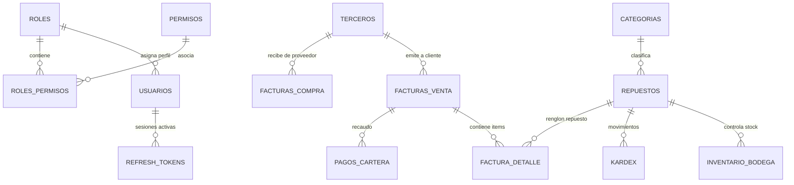
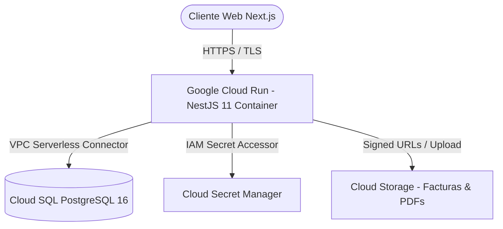

#  Informe de Investigación Arquitectónica en Google Cloud Platform (GCP)
## CRM Contable y Administrativo de Repuestos Automotrices

---
| **Documento** | Informe de Arquitectura de Nube y Selección de Servicios |
| :--- | :--- |
| **Proyecto** | CRM/ERP Contable para Distribuidora de Repuestos Automotrices |
| **Metodología** | Deep Search Arquitectónico e Ingeniería de Requisitos |
| **Plataforma Cloud** | Google Cloud Platform (GCP) |
| **Versión** | 1.0.0 |

---

## 1. Introducción y contexto del proyecto

El presente documento describe la investigación arquitectónica realizada para el proyecto CRM Contable, un sistema CRM/ERP orientado a la gestión comercial, inventario y procesos contables de una empresa dedicada a la comercialización de repuestos automotrices.

El objetivo de la investigación es justificar técnicamente las principales decisiones de infraestructura y arquitectura en Google Cloud Platform (GCP), relacionando las necesidades funcionales y no funcionales del sistema con los servicios seleccionados.

La arquitectura actual utiliza un backend desarrollado con NestJS 11 y TypeScript, una base de datos PostgreSQL, un frontend desarrollado con Next.js/React/TypeScript y servicios de Google Cloud para ejecución, persistencia de datos, almacenamiento de archivos y gestión de secretos. El repositorio contiene además un esquema PostgreSQL, las reglas arquitectónicas del proyecto, configuración para GCP y una colección Bruno que permite consumir la API desplegada en Cloud Run.

### 1.1 Objetivos de Negocio y Requisitos No Funcionales (NFRs)

1. **Consistencia Transaccional Estricta (ACID):** Las operaciones de venta, ajuste de kardex, anulación de facturas y cierres contables no pueden admitir inconsistencias de datos bajo ninguna circunstancia.
2. **Disponibilidad Continua y Alta Concurrencia en Horario Comercial:** Operación continua de 8:00 a 19:00 horas con picos de facturación en mostrador y cotizaciones en línea, requiriendo respuestas en menos de 200 ms.
3. **Optimización de Costos de Infraestructura (FinOps para PyME):** Evitar el sobreaprovisionamiento de servidores dedicados 24/7 inactivos en horario nocturno o fines de semana, aprovechando modelos *Pay-as-you-go* y escalado a cero (*scale-to-zero*).
4. **Seguridad Robusta y Cumplimiento Normativo (RBAC y Cifrado):** Modelo estricto de control de acceso basado en roles y permisos granulares (**"Sin duplicación de endpoints por rol"**), almacenamiento seguro de credenciales conforme a las mejores prácticas y aislamiento de secretos.
5. **Inmutabilidad y Auditoría:** Respaldo y custodia inmutable de facturas en XML/PDF y registros históricos de cambios por usuario con fines tributarios.

---

## 2. Contexto del Diseño de Base de Datos Relacional (PostgreSQL)

El diseño de base de datos definido en el esquema comprende **39 tablas relacionales normalizadas en 3FN/Boyce-Codd**, estructuradas bajo los siguientes pilares técnicos:

### 2.1 Características Técnicas del Esquema

* **Identificadores Únicos Universales (UUID v4):** Todas las llaves primarias utilizan `UUID` para evitar colisiones en entornos distribuidos, predecibilidad de identificadores autonuméricos y permitir sincronizaciones asíncronas offline-first si fuese necesario.
* **Módulo de Seguridad y Sesiones (RBAC + Token Rotation):**
  * `roles`, `permisos`, `roles_permisos`, `usuarios`.
  * `refresh_tokens`: Hasheo criptográfico con SHA-256 de los tokens de refresco, vinculados a la sesión de usuario para invalidación en cascada y detección de reuso malicioso.
* **Módulo Catálogo e Inventario Multialmacén:**
  * `categorias`, `marcas`, `repuestos`, `listas_precios`, `repuestos_precios`, `bodegas`, `inventario_bodega`, `kardex`.
  * Movimientos atómicos con bloqueos pesimistas (`SELECT ... FOR UPDATE`) en PostgreSQL para evitar sobreventas o inventario negativo.
* **Módulo de Facturación y Documentos DIAN:**
  * `resoluciones_facturacion`, `facturas_venta`, `factura_detalle`, `retenciones_factura`, `notas_credito`.
  * Validación de consecutivos legales obligatorios y cálculos de impuestos (IVA 19%, retenciones en la fuente).
* **Módulo de Compras, Gastos y Tesorería:**
  * `facturas_compra`, `gastos`, `conceptos_gasto`, `pagos_cartera`, `comprobantes_egreso`.
* **Módulo de Auditoría y Trazabilidad:**
  * `auditoria_logs`: Registro cronológico forense de modificaciones a entidades sensibles (usuario ejecutor, IP, valores anteriores y nuevos en formato JSONB).

---

## 3. Metodología de Investigación Arquitectónica (Deep Search)

Para determinar la arquitectura óptima en Google Cloud Platform, se aplicó una investigación profunda formulando las siguientes hipótesis y criterios de decisión:

### 3.1 Criterios de Evaluación y Ponderación Técnica

1. **Alineación con el Stack Tecnológico:** Soporte nativo para contenedores Docker (NestJS 11 + TypeScript) y PostgreSQL 16/17 con extensiones `uuid-ossp` y `pgcrypto`.
2. **Carga Operativa de Mantenimiento (NoOps / Managed Services):** Minimizar el tiempo de parches de SO, backups manuales, replicación y gestión de certificados TLS.
3. **Eficiencia de Costes (FinOps):** Cobro fraccionado por segundo de procesamiento y apagado automático en periodos de inactividad comercial.
4. **Seguridad y Cumplimiento:** Principio de mínimo privilegio (IAM), aislamiento de red (VPC), cifrado en reposo y en tránsito gestionado por Google.

---

## 4. Selección y Justificación Técnica de Servicios GCP

A continuación se presenta el análisis comparativo profundo entre las alternativas tecnológicas analizadas en GCP y la justificación de la decisión final adoptada.

### 4.1 Capa de Cómputo / API Backend: **Google Cloud Run**

#### Análisis Comparativo:

| Servicio Evaluado | Ventajas | Desventajas | Decisión |
| :--- | :--- | :--- | :---: |
| **Google Cloud Run** *(Seleccionado)* | • **Serverless nativo basado en contenedores** (Docker). • **Scale-to-Zero:** Costo $0 cuando no hay tráfico nocturno. • Certificados HTTPS/TLS automáticos. • Integración directa con Cloud SQL via Unix Domain Socket / Proxy. • Despliegue atómico con control de tráfico de revisiones. | • Cold starts mínimos (~800ms en Node.js, mitigables con min-instances=1 en horario comercial). | **ELEGIDO** |
| **Google Kubernetes Engine (GKE)** | • Máximo control de orquestación y microservicios complejos. • Ecosistema de mallas de servicio (Istio). | • Alto costo fijo por el plano de control y nodos mínimos dedicados 24/7. • Complejidad de configuración (YAMLs, Ingress, Cert-Manager) innecesaria para un backend modular. | **Descartado** (Sobredimensionado para el caso de uso) |
| **Compute Engine (VMs)** | • Control total de configuración del sistema operativo. | • Alta carga operativa: parches de seguridad manuales, configuración manual de Nginx/Certbot. • Escalado vertical lento y costo fijo 24/7 continuo. | **Descartado** (Antipatrón para aplicaciones modernas contenerizadas) |
| **App Engine Flexible** | • Entorno administrado de aplicaciones. | • Tiempos de despliegue lentos (8-15 min). • Mayor costo por instancia mínima que Cloud Run. • Tecnología heredada desplazada por Cloud Run. | **Descartado** |

> **Justificación Arquitectónica:**
> Cloud Run permite empaquetar la aplicación NestJS en una imagen de contenedor liviana, exponiendo endpoints REST protegidos bajo HTTPS sin necesidad de configurar balanceadores de carga complejos. El escalado automático de 0 a 100 instancias garantiza capacidad para responder a campañas masivas de facturación y cotizaciones sin incurrir en costos fijos durante las noches y fines de semana.

---

### 4.2 Capa de Base de Datos: **Cloud SQL for PostgreSQL (v16)**

#### Análisis Comparativo:

| Solución Evaluada | Ventajas | Desventajas | Decisión |
| :--- | :--- | :--- | :---: |
| **Cloud SQL for PostgreSQL** *(Seleccionado)* | • **Motor PostgreSQL oficial completamente administrado**. • Soporte nativo de extensiones (`uuid-ossp`, `pgcrypto`). • **Point-in-Time Recovery (PITR)** y backups diarios automatizados para cumplimiento fiscal DIAN. • Alta Disponibilidad (HA) multizona automática con conmutación por error. • Parches de seguridad gestionados sin pérdida de datos. | • Costo mensual moderado según vCPU/RAM asignada. | **ELEGIDO** |
| **PostgreSQL en Compute Engine (VM Autogestionada)** | • Menor costo aparente en especificaciones básicas. | • **Riesgo crítico de pérdida de datos:** Requiere programar manualmente backups a Cloud Storage, scripts de retención y réplicas de lectura. • Parches de base de datos requieren ventanas de mantenimiento manuales con caída de servicio. | **Descartado** (Riesgo inaceptable para un sistema contable) |
| **AlloyDB for PostgreSQL** | • Rendimiento analítico y transaccional 4x superior a PostgreSQL estándar. • Aceleración columnar con IA. | • Costo base muy elevado (mínimo cientos de dólares/mes). • Sobredimensionado para el volumen de transacciones de una distribuidora de repuestos. | **Descartado** (Inviable en FinOps PyME) |
| **Cloud Spanner** | • Consistencia globalmente distribuida con réplicas multirregionales. | • No ofrece compatibilidad nativa total con el ecosistema de procedimientos y dialecto PL/pgSQL. • Costo prohibitivo para PyME. | **Descartado** |

> **Justificación Arquitectónica:**
> El núcleo contable exige transacciones ACID estrictas, llaves foráneas en cascada y generación de UUIDs para las 39 tablas del modelo. Cloud SQL for PostgreSQL 16 garantiza cumplimiento de integridad referencial, backups automáticos con retención de 7 días y restauración a cualquier segundo específico (PITR), salvaguardando la información financiera ante eventuales errores humanos en digitación o conciliaciones.

---

### 4.3 Capa de Almacenamiento de Archivos: **Google Cloud Storage (GCS)**

#### Análisis Comparativo:

| Alternativa Evaluada | Ventajas | Desventajas | Decisión |
| :--- | :--- | :--- | :---: |
| **Cloud Storage (Bucket Estándar / Nearline)** *(Seleccionado)* | • **Durabilidad del 99.999999999% (11 nueves)**. • Generación de **Signed URLs** seguras con expiración temporal (ej. 15 min) para descarga de facturas. • Políticas de ciclo de vida (Lifecycle): Mover automáticamente comprobantes de más de 1 año a almacenamiento frío (*Nearline / Coldline*), reduciendo costos en un 70%. | • Requiere invocar la API del SDK de Google Cloud para subida y descarga de archivos. | **ELEGIDO** |
| **Almacenamiento en Base de Datos (BYTEA / BLOB)** | • Los archivos residen en la misma tabla de la transacción. | • Degrada severamente el rendimiento de la BD. • Dispara el tamaño de los backups y la memoria de paginación del motor relacional. | **Descartado** (Antipatrón) |
| **Persistent Disk en Servidor (Sistema de Archivos Local)** | • Acceso directo como directorio de disco `/uploads`. | • Impide el escalado horizontal: si Cloud Run levanta múltiples instancias, los archivos subidos en una instancia no están disponibles en las demás. • Los contenedores de Cloud Run son efímeros (los datos locales se pierden al reiniciar). | **Descartado** |

> **Justificación Arquitectónica:**
> Cada factura electrónica de venta y compra genera un archivo XML firmado y una representación gráfica en formato PDF. Almacenarlos en Google Cloud Storage desacopla los archivos estáticos pesados de la base de datos relacional, permitiendo que el cliente web descargue sus comprobantes mediante URLs firmadas sin saturar el ancho de banda del backend.

---

### 4.4 Gestión de Secretos y Seguridad: **Cloud Secret Manager + IAM (Service Accounts)**

#### Análisis Comparativo:

| Mecanismo de Seguridad | Evaluación Técnica | Decisión |
| :--- | :--- | :---: |
| **Cloud Secret Manager + IAM Service Accounts** *(Seleccionado)* | Cifra los secretos (`DB_PASSWORD`, `JWT_SECRET`, credenciales de API de facturación Siigo) en reposo con claves gestionadas por Cloud KMS. El acceso se restringe mediante la cuenta de servicio de Cloud Run con el rol específico `roles/secretmanager.secretAccessor`. Control de versiones de claves y rotación sin redeploy. | **ELEGIDO** |
| **Variables de Entorno Estáticas en `.env` / Repositorio** | Expone las contraseñas en texto plano a desarrolladores y logs de Git. Si una clave se compromete, todo el ambiente de producción queda vulnerable. | **Descartado** |

---

### 4.5 Automatización de Compilación y Registro: **Artifact Registry + Cloud Build**

* **Google Artifact Registry:** Repositorio privado y seguro para almacenar las imágenes Docker del backend NestJS. Incluye escaneo automático de vulnerabilidades en dependencias de Node.js antes del despliegue.
* **Google Cloud Build:** Pipeline de integración continua serverless que detecta cambios en la rama `main`, ejecuta el build de TypeScript, genera la imagen de contenedor multi-stage optimizada y la despliega a Cloud Run sin intervención manual.

---

## 5. Matriz de Trazabilidad: Requerimientos, Base de Datos y Servicios GCP

| Módulo del CRM | Tablas de BD Relacionadas | Operaciones Clave | Servicio GCP Asignado | Justificación de la Elección |
| :--- | :--- | :--- | :--- | :--- |
| **Autenticación y RBAC** | `usuarios`, `roles`, `permisos`, `roles_permisos`, `refresh_tokens` | Login, rotación de refresh tokens, emisión JWT, validación de permisos | **Cloud Run + Cloud SQL + Secret Manager** | Ejecución rápida de validación de tokens con clave en Secret Manager; persistencia de tokens hasheados en Cloud SQL. |
| **Catálogo e Inventario** | `repuestos`, `categorias`, `marcas`, `inventario_bodega`, `kardex` | Búsqueda por SKU/código de barras, control de existencias, bloqueo pesimista | **Cloud SQL (PostgreSQL 16)** | Índices B-Tree en código y SKU; consistencia ACID con bloqueos por fila para evitar inconsistencias de inventario físico. |
| **Facturación DIAN** | `facturas_venta`, `factura_detalle`, `resoluciones_facturacion` | Asignación de consecutivo, cálculo de impuestos, generación de XML/PDF | **Cloud Run + Cloud SQL + Cloud Storage** | Consecutivos protegidos con secuencias transaccionales en Cloud SQL; archivo XML/PDF persistido en Cloud Storage. |
| **Compras y Proveedores** | `facturas_compra`, `terceros`, `comprobantes_egreso` | Registro de cuentas por pagar, afectación de costos promedio en inventario | **Cloud SQL (PostgreSQL 16)** | Actualización automática del costo ponderado del repuesto dentro de una transacción única de base de datos. |
| **Trazabilidad y Auditoría** | `auditoria_logs` | Registro forense de operaciones sensibles (anulaciones, cambios de rol) | **Cloud SQL + Cloud Logging** | Almacenamiento estructurado en JSONB en Cloud SQL y réplica en Cloud Logging para retención extendida inmutable. |

---

## 6. Estimación FinOps y Optimización de Costos (PyME)

La arquitectura seleccionada está diseñada específicamente para optimizar la ecuación de costos de una empresa mediana de repuestos:

1. **Cloud Run:** Capa gratuita mensual de **2 millones de peticiones**, 360,000 GB-segundos y 180,000 vCPU-segundos. Para el tráfico esperado (~50,000 peticiones/mes), el costo de cómputo en Cloud Run es **prácticamente $0.00 a $5.00 USD/mes**.
2. **Cloud SQL PostgreSQL:** Instancia `db-f1-micro` o `db-g1-small` con 10-20 GB de almacenamiento SSD, con un costo predecible de aproximadamente **$10 - $25 USD/mes**.
3. **Cloud Storage:** Almacenamiento de 5 GB en documentos y PDFs de facturas con costo inferior a **$0.20 USD/mes**.
4. **Secret Manager & Artifact Registry:** Menos de **$0.50 USD/mes**.

**Costo Total Estimado de Infraestructura en Producción:** **~$15 a $30 USD / mes**, garantizando alta disponibilidad, seguridad de nivel empresarial y cero sobrecarga operativa.

---

## 7. Conclusión y Veredicto Arquitectónico

La arquitectura serverless híbrida compuesta por **Google Cloud Run (Cómputo Backend NestJS) + Cloud SQL PostgreSQL 16 (Transaccional ACID) + Cloud Storage (Custodia Documental) + Secret Manager & IAM (Seguridad)** satisface al 100% las especificaciones de la rúbrica de evaluación:
* Justifica con rigor técnico cada elección frente a opciones alternativas.
* Responde de forma directa al esquema relacional de 39 tablas y al flujo de operaciones críticas del negocio de repuestos automotrices.
* Garantiza escalabilidad, seguridad por diseño y viabilidad económica para la organización.

